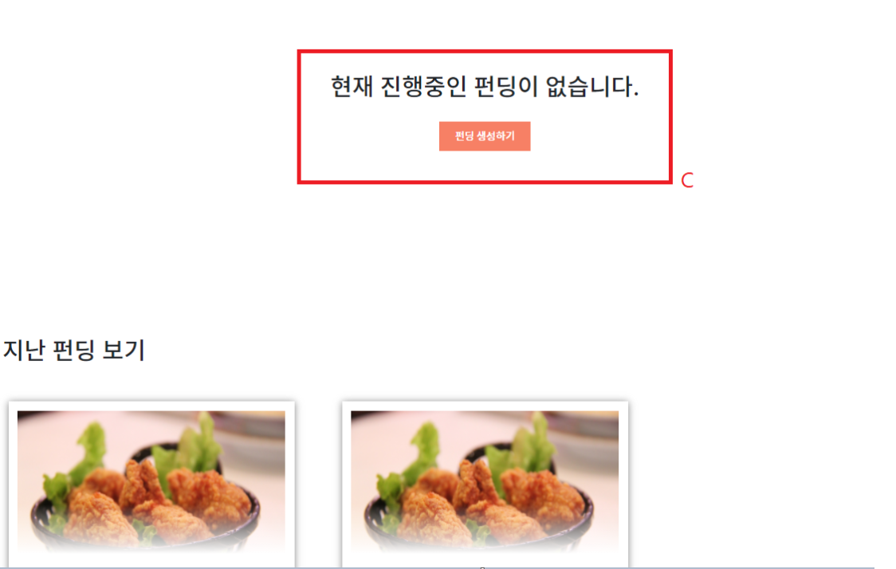

## 1. gitlab 소스 클론 이후 빌드 및 배포할 수 있는 작업 문서

#### 	사용한 JVM, 웹서버, WAS 제품 등의 종류와 설정값, 버전(IDE버전 포함) 기재

​		1. SpringBoot : 2.5.4 ver

​		2. JVM : jdk11.0.2 ver

​		3. UBUNTU : UBUNTU18.0.4

​		4. ETHEREUM : 도커 이미지 - pjt3591oo/ethereum-geth  1.90

​		5. Solidity Compiler : 0.4.23

​		6. MySQL : 8.0.23 ver

#### 	빌드 시 사용되는 환경 변수 등의 주요 내용 상세 기재

​		1. Path 환경 변수에 C:\\Program Files\\jdk11\\bin 경로를 추가

​		2. STS경로에 lombok추가 후 CMD를 이용하여 lombok경로에 접근

​		3. CMD에서 java -jar lombok.jar실행, STS.exe선택후 Install / Update 적용

​		4. STS 내부 메뉴바에서 Project > Clean을 적용하여 Getter/Setter 에러 제거

#### 	배포 시 특이사항 기재

​		1. CI / CD 가 적용되어있으므로 git push시 자동으로 배포환경에서 적용됨

​		2. 서버가 닫혀있을 시 : http://j5d101.p.ssafy.io:9090/job/berrygood/ 로 접근하여 

​			Buildnow 실행

​		3. 중복 실행으로 빌드과정에서 컨테이너 삭제관련 에러가 발생할 경우 해당 컨테이너 삭제후 빌			드 재실행 

​		4. 데이터베이스 접속 정보 등 프로젝트(ERD)에 활용되는 주요 계정 및 프로퍼티

​			a) DB HostName : j5d101.p.ssafy.io

​			b) Port : 3306

​			c) UserName : user

​			4) UserPassWord : password

## 2. 프로젝트에서 사용하는 외부 서비스 정보 문서

 	1. ETHEREUM : https://ethereum.org/ko/learn/

## 3. 데이터베이스 덤프 파일 최신본

경로 : exec폴더의 BerryGood DB 덤프파일 폴더

## 4. 시연 시나리오(스크립트 포함)

1. #### 메인페이지

   

   

   A) 베리굿의 홈으로 이동

   B) 베리굿에 등록된 기부페이지로 이동

   C) 베리굿에 등록된 펀딩페이지로 이동

   D) 베리굿에 등록된 활동페이지로 이동

   E) 헌혈증을 등록가능한 헌혈페이지로 이동

   F) 일반 / 기업 로그인페이지로 이동

   G) 일반 / 기업 회원가입 페이지로 이동

2. #### 회원가입 페이지

   

   A) 일반 회원으로 회원가입을 진행

   b) 기업 회원으로 회원가입을 진행

3. #### 로그인 페이지

   

   A) 일반 회원으로 로그인

   b) 기업 회원으로 로그인

4. #### 마이페이지

   1)

   

   2)

   

   A) 베리굿 사이트에서 사용가능한 베리를 충전할 수 있는 지갑을 생성, 충전 및 조회

   B) 베리굿에서 거래한 내용(기부, 펀딩 등의) 거래내역(트랜잭션) 을 확인할 수 있음

   C) 베리굿에서 기부했던 내역을 확인할 수 있음

   D) 베리굿에서 등록했던 헌혈증 목록을 확인할 수 있음

   E) 베리굿에서 진행했던 봉사활동 목록을 확인할 수 있음

   F) 베리굿에서 자신이 획득한 뱃지 목록을 나타냄

5. #### 기부

   ##### 5-1 기부페이지

   - 기업회원 화면

     

   - 일반회원 화면

   

   A)

   ​	1)의 상태(유저 로그인)에서는 기부 생성이 불가능하고 참여만 가능함

   ​	2)의 상태(기업 로그인)에서는 기부 생성이 가능하고 참여는 불가능

   B) 해당 기부의 상세 기부페이지로 이동

   ##### 5-2 상세 기부 페이지

   

   

   A) 기부할 때 작성한 응원의 메시지가 나타남

   B) 유저 로그인 상태에서 가능하며 기부를 참여할 수 있음

   ​	a) 실명 공개를 원치 않을 경우 익명으로 대체함

   ​	b) 계정의 잔여 베리를 조회

   ​	c) 베리 충전함

   ​	d) 위에서 작성한 내용으로 기부를 진행

   ##### 5-3 기부 생성 페이지

   

   - 위의 내용을 모두 작성한 후 작성완료 버튼을 누르면 기부글이 게시됨

6. #### 펀딩

   ##### 6-1 펀딩페이지

   

   

   ​	-      유저 로그인에서는 펀딩 생성이 불가능하고 참여만 가능함

   ​			기업 로그인에서는 펀딩 생성이 가능하고 참여는 불가능

   ​	A)	현재 진행중인 펀딩의 상세페이지로 이동

   ​	B)	만료된 펀딩들이 리스트로 보여짐

   ​	C)	현재 진행중인 펀딩이 나타남

   ​			현재 진행중인 펀딩이 없다면 기업회원은 새로운 펀딩을 등록할 수 있음

   ##### 6-2 상세 펀딩 페이지

   

   

   ​	A) 현재 참여중인 인원과 목표달성치를 나타냄

   ​	B) 유저 로그인 상태에서 가능하며 기부를 참여할 수 있음

   ​		a) 실명 공개를 원치 않을 경우 익명으로 대체함

   ​		b) 계정의 잔여 베리를 조회

   ​		c) 베리 충전함

   ​		d) 위에서 작성한 내용으로 펀딩을 진행

   ##### 6-3 펀딩 생성 페이지

   

   - 위의 내용을 작성하고나서 작성완료 버튼을 눌러서 펀딩 생성

7. #### 활동

   ##### 7-1 활동페이지

   

   ​	A) 진행중인 활동 목록이 나타고 해당 활동을 클릭 시 상세페이지로 이동

   ​	B) 봉사활동 등록페이지로 이동

   ##### 7-2 상세 활동 페이지

   

   ​	A) 목표 달성치를 나타냄

   ​	B) 해당 봉사에 참여 / 참여취소를 함

   ##### 7-3 활동 등록 페이지

   ​	

   - 위의 내용을 작성 후 작성완료 버튼을 눌러서 활동 생성

8. #### 헌혈

   ##### 8-1 헌혈증 등록페이지

   

   - 헌혈증 등록페이지의 모든 내용을 작성하고나면 아래처럼 등록하기 버튼이 나타나고

     버튼을 클릭하여 헌혈증을 등록함.
