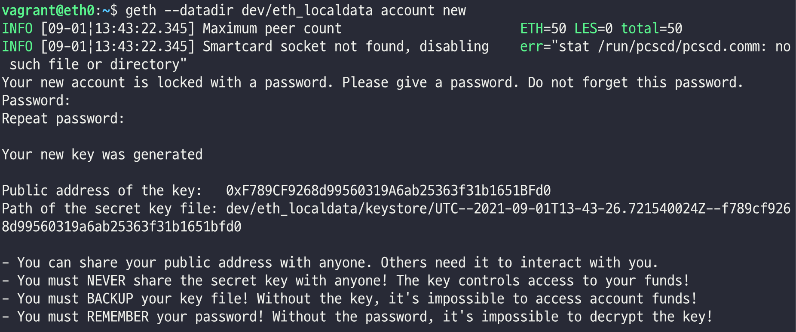
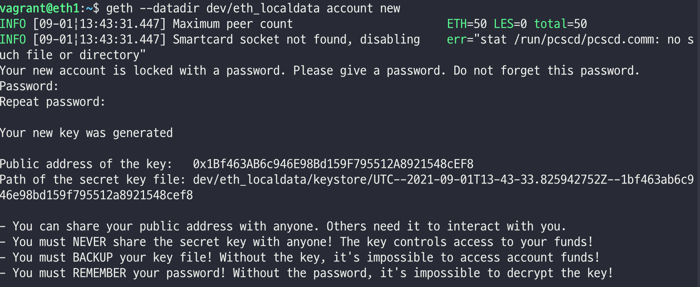
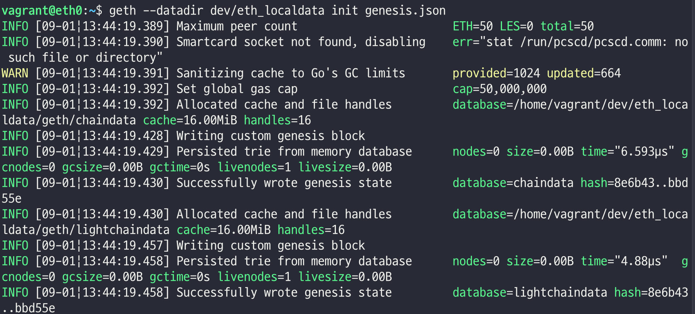
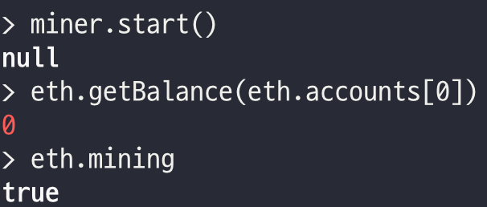
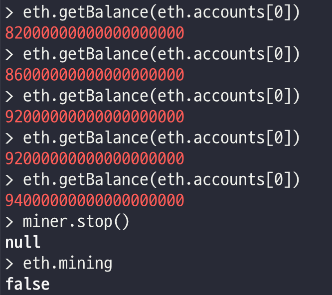
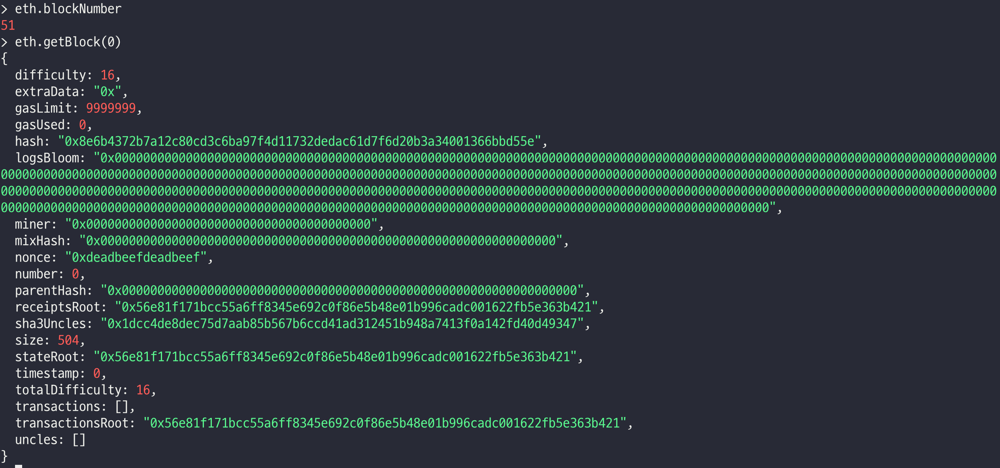

# 이더리움 계정 생성

<br/>
<br/>

## 계정 생성

`노드실행 전까지 eth0, eth1 동일하게 진행`

<br/>

1. 계정 생성

``` bash
geth --datadir dev/eth_localdata account new

geth 명령어에서도 가능
```





2. genesis block 생성

``` bash
geth --datadir dev/eth_localdata init genesis.json
```



3. 노드 실행
   - eth0
      ```
      geth --networkid 921 --nodiscover --maxpeers 2 --datadir dev/eth_localdata --rpcaddr 0.0.0.0 --rpc --rpcport 8545 --allow-insecure-unlock --rpccorsdomain "*" --rpcapi="db,eth,net,web3,personal,miner,admin" --miner.threads 1 console 2>> dev/eth_localdata/geth.log
      ```
   - eth1
      ```
      geth --networkid 921 --syncmode 'full' --maxpeers 2 --datadir dev/eth_localdata --rpcaddr 127.0.0.1 --rpc --rpcport 8545 --allow-insecure-unlock --rpccorsdomain "*" --miner.threads 1 console 2>> dev/eth_localdata/geth.log
      ```

## 코인베이스(Coinbase) 설정

<br/>

코인 베이스 설정
```bash
miner.setEtherbase(personal.listAccounts[0])

채굴시 보상받는 계정설정 가능
```

## 마이닝(Mining) 시작

<br/>

1. 마이닝 시작

```
miner.start()
```



2. 마이닝 정지

```
miner.stop()
```



`eth.mining` 을 통해 mining 여부 확인 가능

PC 부하를 고려하여 이더를 일정량 확보하면 중단을 추천

`eth.blockNumber` 로 생성된 블록의 수 조회가능

`eth.getBlock(0)` 로 0번째 블록의 정보출력

