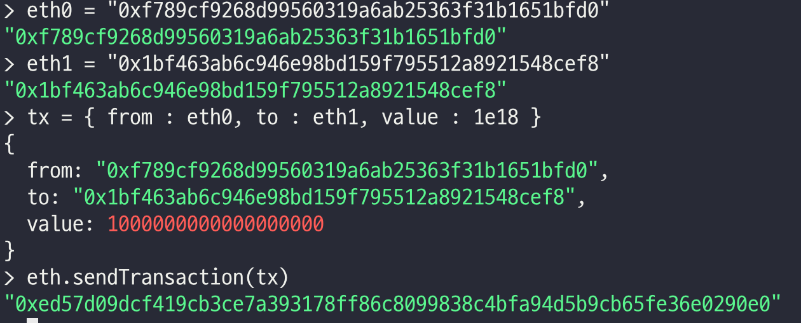

# 이더리움 트랜잭션 생성

<br/>
<br/>

## 노드 연결

<br/>

`트랜잭션을 생성하기전 Multi node들간 BlockChain 통신을 위해서 노드간 연결이 필요합니다.`

- eth1의 enode조회
  - `admin.nodeInfo.enode`
  
  

- `eth0 에서는@뒤의 ip 주소를 public ip 주소로 바꿔야한다.`

  현재 Vagrantfile에서 11로 설정해주었기 때문에 192.168.50.11로 변경 해준다.

  `admin.addPeer()` 명령 사용

- node가 정상적으로 연결되었는지 확인

```
admin.peers
net.peerCount
```


<br/>

## 트랜잭션 생성

<br/>

`eth0에서 진행`

트랜잭션을 보내기위해서는 locked 해제해야한다!!

해제하는 방법 3가지
1. web3.personal.unlockAccount(eth.coinbase)
2. web3.personal.unlockAccount(eth.coinbase, "계정명")
3. personal.unlockAccount("주소")

<br/>

- 계정 간 이더 전송 트랜잭션 생성

```
tx = { from : eth0 주소, to : eth1 주소, value: 1e18}

각각의 주소는 eth.accounts[0]로 확인가능

eth.sendTransaction(tx) 명령으로 트랜잭션 보내기
```



<br/>

`eth.getTransaction(트랜잭션해시값)` 으로 트랜잭션 상태 조회


`마이닝 상태가 아니므로 blockHash와 blockNumber가 null값`

`따라서, miner.start()를 통해 마이닝 재시작`

<br/>


마이닝 시작 후 트랜잭션 상태를 조회하면 blockHash와 blockNumber에 값이 들어간것을 확인 할 수 있다.

이제 `eth1에서 값이 제대로 갔는지 확인`

