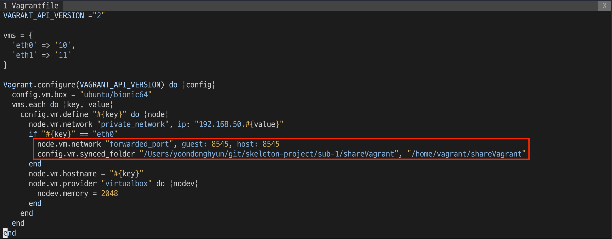
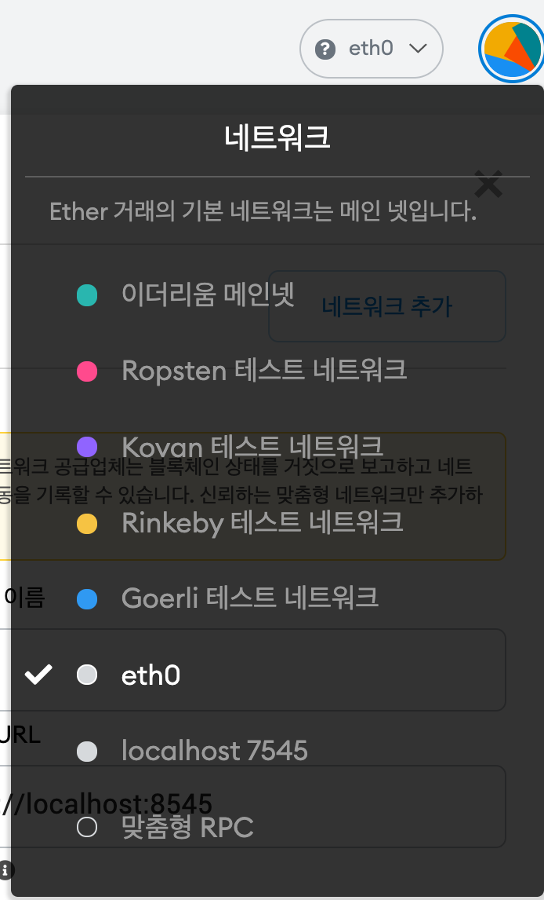
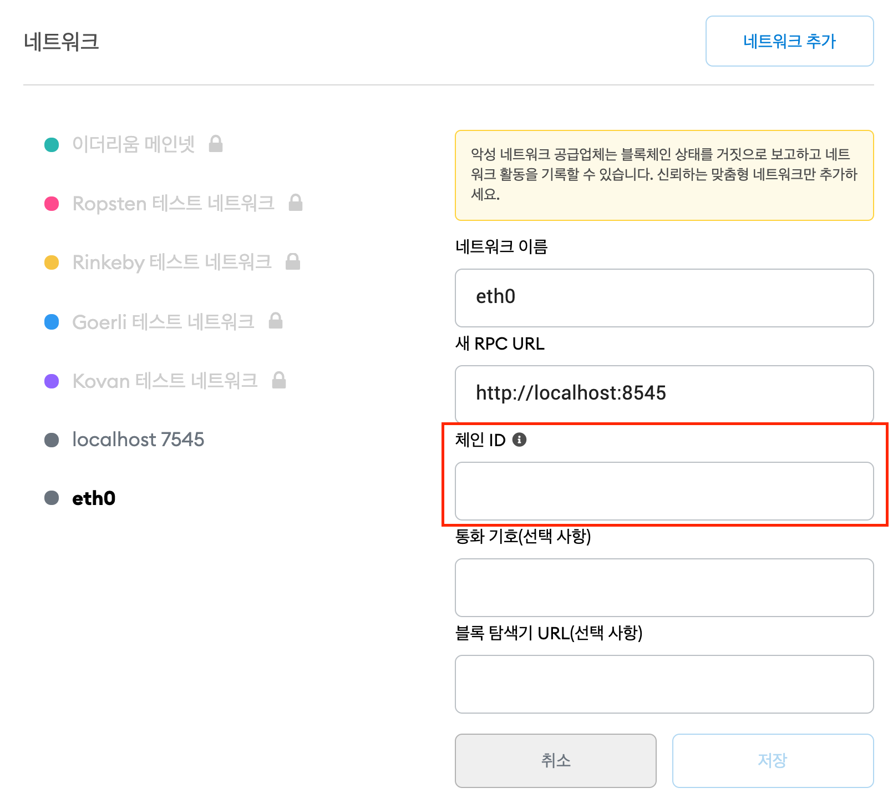
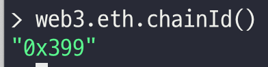
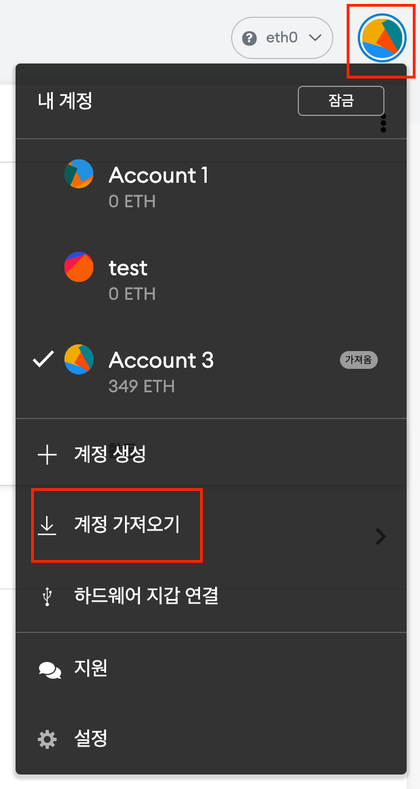
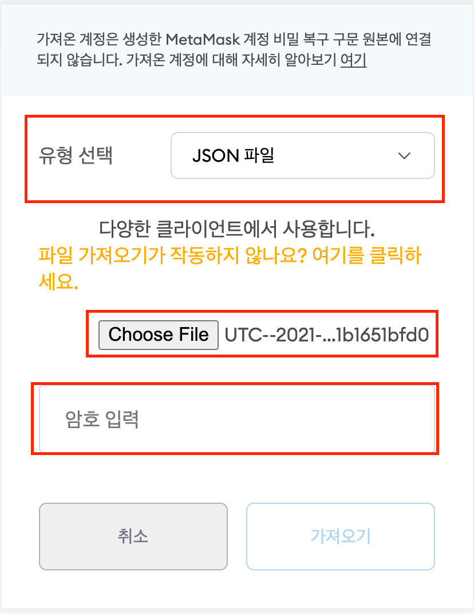
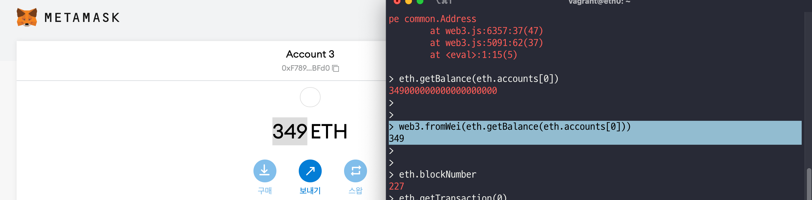
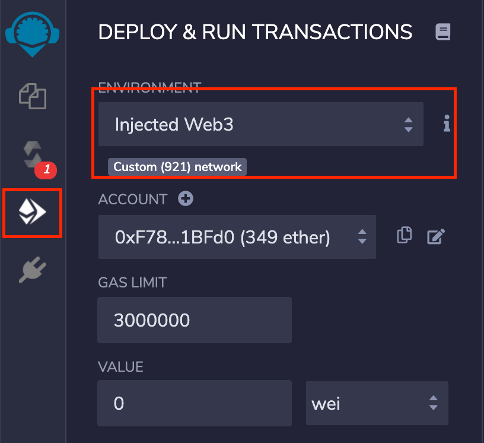
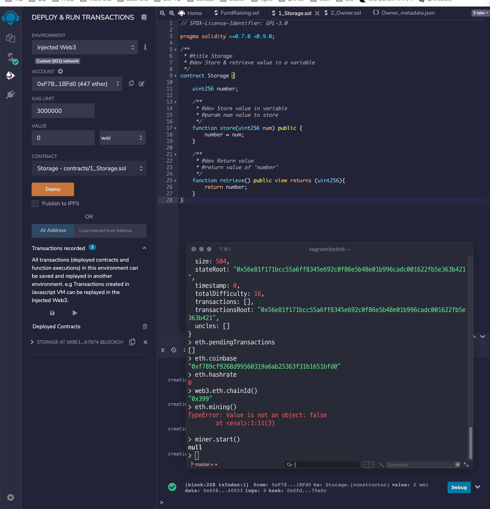
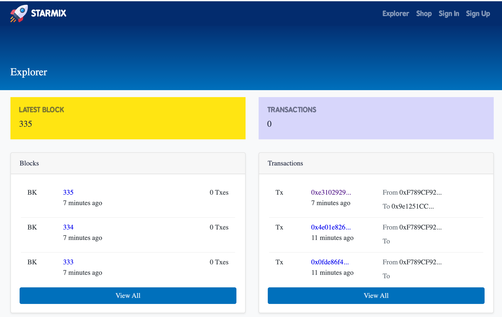

# 스마트컨트랙트 배포

 
 

## eth0 노드 확인

 

`Vagrantfile에서 포드포워딩` 

`공유폴더로 지정해서 내부에서 keystrore를 복사해서 공유폴더에 저장하면 로컬에서 파일 사용할수 있게함.`

 

## Metamsk 계정 등록

 

 

 

`체인 ID는 geth명령어로 확인이 가능합니다.`

`아니면 genesis.json에서 설정한 체인 ID를 16진수 형태로 사용하시면 됩니다.`

 

이제 계정 Import를 시작해봅시다.

 

`json파일로 선택하고 공유폴더에서 keystore json을 선택합니다.`

`비밀번호는 사용자가 입력한 비밀번호입니다.`

 

`응답이 되지 않는다고 당황하지않고 기다리면 다음과 같이 계정이 연결된것을 알 수 있습니다.`

## 스마트 컨트랙트 배포(Remix)

 

 

`연동 후 기본 제공 파일을 Compile한다.`

`eth0에서 miner.start()를 통해 트랜잭션 받을 준비를 한다.`

그러면 하단에 remix에서 성공표시가 뜬다.

 

## 블록 정보 조회

frontend에서

npm install

npm run serve로 블록체인 네트워크와 연동하여 확인하는 것을 확인 가능

